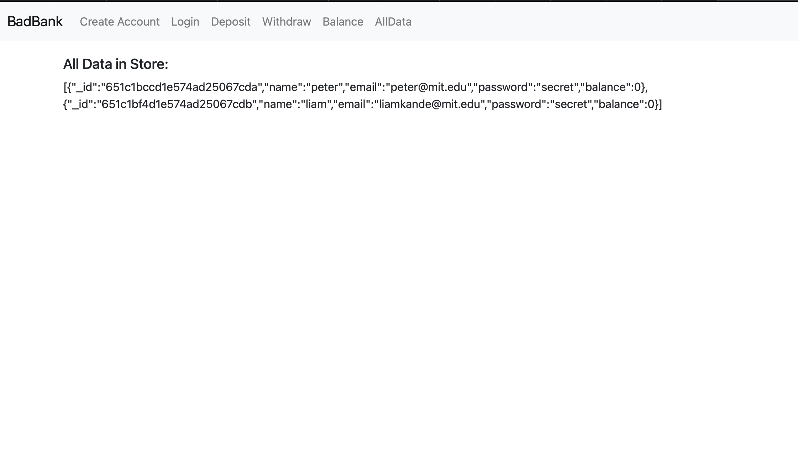

# Banking Application Refactoring

## Description/Motivation

The Banking Application Refactoring project aims to enhance the backend architecture of our banking software. This refactoring is driven by the need for improved database management and data abstraction, ensuring a more efficient and scalable banking system. Our goal is to streamline data storage, retrieval, and processing, ultimately leading to a better banking experience for our users.

**Key Objectives:**
- Implement a robust data abstraction layer (DAL) using Express.js and MongoDB.
- Enhance database management by leveraging Docker for MongoDB deployment.
- Improve data interactions and transactions within the application.

## Installation Guidelines

To set up the Banking Application Refactoring project on your local machine, follow these steps:

1. Clone this repository to your local environment.

2. Change your working directory to the project folder:

3. Install project dependencies:

## Screenshots

Here's a screenshot of the Express Data Access Layer (DAL) setup:



## Testing with Studio 3T

To test your MongoDB database using Studio 3T, follow these steps:

1. Launch Studio 3T and ensure it is connected to your MongoDB instance.

2. In Studio 3T, you should see a "Connect" button or option. Click on it to establish a connection to your MongoDB server.

3. Configure the connection settings. Typically, this involves specifying the host (localhost) and port (27017).

4. Once you've connected to your MongoDB server in Studio 3T, you can explore your database, collections, and documents using the graphical interface.

5. You can interact with your MongoDB database programmatically by running JavaScript files, similar to what you did with the `mongo_test.js` file in your project. To do this, follow these steps:

a. Create a new JavaScript file, e.g., `studio3t_test.js`, in the same directory as your project.

b. In this file, you can use JavaScript code to interact with your database using the MongoClient. For example:

```javascript
const MongoClient = require('mongodb').MongoClient;

const url = 'mongodb://localhost:27017';

// connect to MongoDB
MongoClient.connect(url, { useUnifiedTopology: true }, function (err, client) {
  if (err) throw err;

  console.log('Connected successfully to server');

  // Your database interactions go here

  // Clean up and close the connection
  client.close();
});

```
c. Save the file.

In Studio 3T, you can open the "File" menu and choose "Open File" to select and open your `studio3t_test.js` file.

With the file open, you can execute the JavaScript code by clicking the "Run" or "Execute" button in Studio 3T. This will run your code and interact with your MongoDB database.

You can view the results of your code execution within Studio 3T.

This allows you to test and interact with your MongoDB database using Studio 3T's graphical interface while running custom JavaScript code for more advanced operations.

Please note that Studio 3T might have specific steps or variations based on its version, so consult Studio 3T's documentation or user guides for any version-specific instructions.

## Technology Used

- Express.js
- MongoDB
- Docker

## Features

- **Database Abstraction**: We've implemented a data abstraction layer (DAL) to simplify database interactions.
- **Docker Deployment**: Utilizing Docker for MongoDB deployment ensures scalability and ease of management.
- **Express Routes**: We've integrated Express routes to handle various banking operations.
- **User Management**: You can create and manage user accounts seamlessly through API endpoints.

## License

This project is licensed under the MIT License. You can find the details in the [LICENSE](./LICENSE) file.

## Learning Outcome Addressed

- Set up a database and data abstraction layer (DAL).
- Configure MongoDB using Docker for efficient database management.
